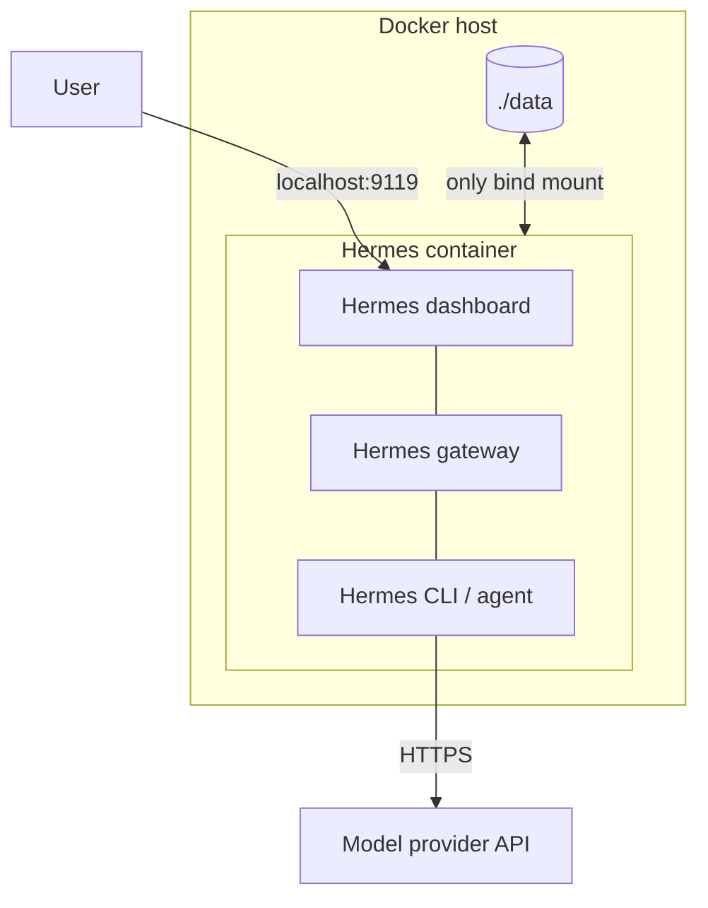

# Hermes Agent in Docker

Run Hermes Agent with a local-only dashboard at <http://localhost:9119>.

## Architecture



## Setup

macOS / Linux:

```bash
./scripts/setup.sh
```

Windows PowerShell:

```powershell
.\scripts\setup.ps1
```

The setup wizard asks for your model provider and API key, then starts Hermes.

## Commands

```bash
# Start, stop, restart
docker-compose start hermes
docker-compose stop hermes
docker-compose restart hermes

# Remove the container, then recreate it
docker-compose down
docker-compose up -d

# Logs and CLI
docker-compose logs -f hermes
docker-compose exec hermes hermes
```

On Windows, use `docker compose` instead of `docker-compose`.

## Files

- `compose.yaml`: Docker service
- `.env`: local dashboard credentials; never commit it
- `data/`: Hermes state; never commit it

Persian: [README_fa.md](README_fa.md)
