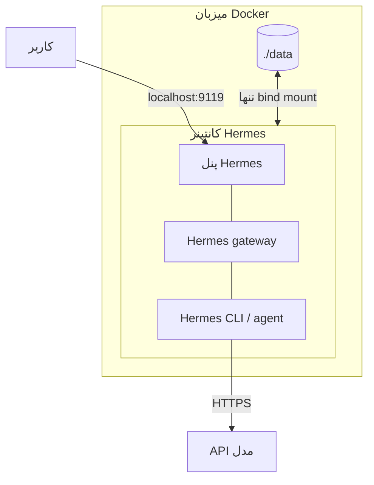

# اجرای Hermes Agent با Docker

پنل: <http://localhost:9119>

## معماری



## راه‌اندازی

macOS / Linux:

```bash
./scripts/setup.sh
```

Windows PowerShell:

```powershell
.\scripts\setup.ps1
```

در wizard، provider و API key مدل را وارد کن؛ سپس Hermes اجرا می‌شود.

## دستورها

```bash
docker-compose start hermes
docker-compose stop hermes
docker-compose restart hermes
docker-compose down
docker-compose up -d
docker-compose logs -f hermes
docker-compose exec hermes hermes
```

در Windows از `docker compose` استفاده کن، نه `docker-compose`.

## فایل‌ها

- `compose.yaml`: سرویس Docker
- `.env`: اطلاعات محلی پنل؛ commit نکن
- `data/`: داده‌های Hermes؛ commit نکن

English: [README.md](README.md)
